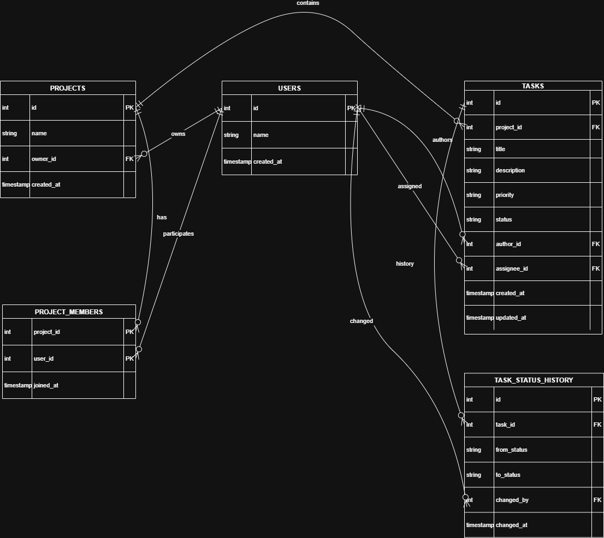

# Task Tracker API

REST API сервис для управления задачами внутри проектов.

Реализовано на FastAPI с использованием асинхронного SQLAlchemy и PostgreSQL.  
Проект поддерживает создание задач, фильтрацию, пагинацию, управление статусами через FSM и хранение истории изменений.

## ER diagram



## Технологический стек

- Python 3.12
- FastAPI
- SQLAlchemy (async)
- PostgreSQL
- Alembic
- Pydantic
- Docker / Docker Compose

## Архитектура проекта

Проект разделён на слои:

```text
app/
  api/            HTTP endpoints
  services/       бизнес-логика
  repositories/   слой работы с БД
  models/         SQLAlchemy модели
  schemas/        Pydantic схемы
  db/             engine и session
  main.py         точка входа FastAPI
```

Такое разделение позволяет:

- отделить HTTP слой от бизнес-логики
- упростить поддержку кода
- облегчить тестирование

## Модель данных

В системе используются следующие сущности:

users  
Пользователи системы

projects  
Проекты

project_members  
Связь пользователей и проектов (many-to-many)

tasks  
Задачи

task_status_history  
История изменения статусов задач

## FSM статусов задач

Поддерживаемые статусы:

- created
- in_progress
- review
- done
- cancelled

Разрешённые переходы:

created → in_progress  
in_progress → review  
review → done  
created → cancelled  
in_progress → cancelled  

При попытке выполнить невалидный переход API возвращает 400 Bad Request.

## Запуск проекта

1. Клонировать репозиторий

```
git clone https://github.com/kolofas/task-tracker-test.git
cd task-tracker-test
```


2. Запустить контейнеры
```
docker compose up --build -d
```
3. Применить миграции
```
docker exec -it task-tracker-app alembic upgrade head
```
4. Открыть Swagger

http://localhost:8000/docs

## Seed данные

После применения миграций автоматически создаются:
```
User  
id = 1

Project  
id = 1  
owner_id = 1
```
Это позволяет сразу тестировать API.

## Примеры запросов

Создание задачи
```
POST /tasks/

{
  "project_id": 1,
  "title": "Test task",
  "description": "First task",
  "priority": "medium",
  "author_id": 1,
  "assignee_id": 1
}
```
Получение задачи
```
GET /tasks/{id}
```
Получение списка задач
```
GET /tasks/?limit=10&offset=0
```
Изменение статуса задачи
```
PATCH /tasks/{id}/status

{
  "new_status": "in_progress",
  "changed_by": 1
}
```
История изменений статусов
```
GET /tasks/{id}/history
```
## Пагинация

Используется offset pagination.

Параметры:

limit  
offset

Пример:
```
GET /tasks/?limit=20&offset=40
```
## Логи

Просмотр логов контейнера:
```
docker compose logs -f app
```
## Тестирование API

API можно протестировать:

- через Swagger ( /docs )
- через curl
- через Postman